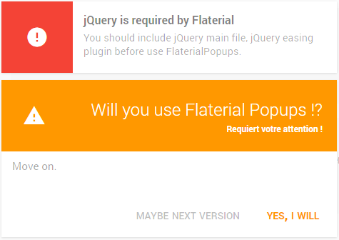
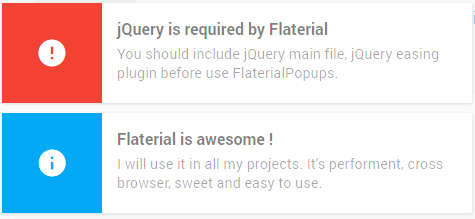

# FlaterialPopups
Plugin jQuery popup du template Flaterial (à venir), du concept Flaterial.

Très efficace, simple d'utilisation, cross-browser et avec une interface simple et parlante.

## Screenshots




## Utilisation

### Pré-requis : jQuery, jQuery.easing, Material Design Iconic

jQuery
```javascript
	<script type="text/javascript" src="path/to/jquery"></script>
```

jQuery easing
```javascript
<script type="text/javascript" src="path/to/jquery.easing"></script>
```

Material Design Iconic
```css
<link type="text/css" rel="stylesheet" href="path/to/material-design-iconic">
```

### Add FlaterialPopups's css and js

CSS
```css
<link type="text/css" rel="stylesheet" href="path/to/flaterial.popups.min.css">
```

JS
```javascript
<script type="text/javascript" src="path/to/flaterial.popups.min.js"></script>
```

### Exemples

```javascript
	var PopupsGroup = new FlaterialPopups().init({
		type: "info",
		title: "Flaterial is awesome !",
		body: "I will use it in all my projects. It's performent, cross browser, sweet and easy to use.",
		hasBackdrop: true,
		queue: false
	});
	var popup_1 = new PopupsGroup.Popup().show();
	var popup_2 = new PopupsGroup.Popup().show();
```

For more examples, see **demo**